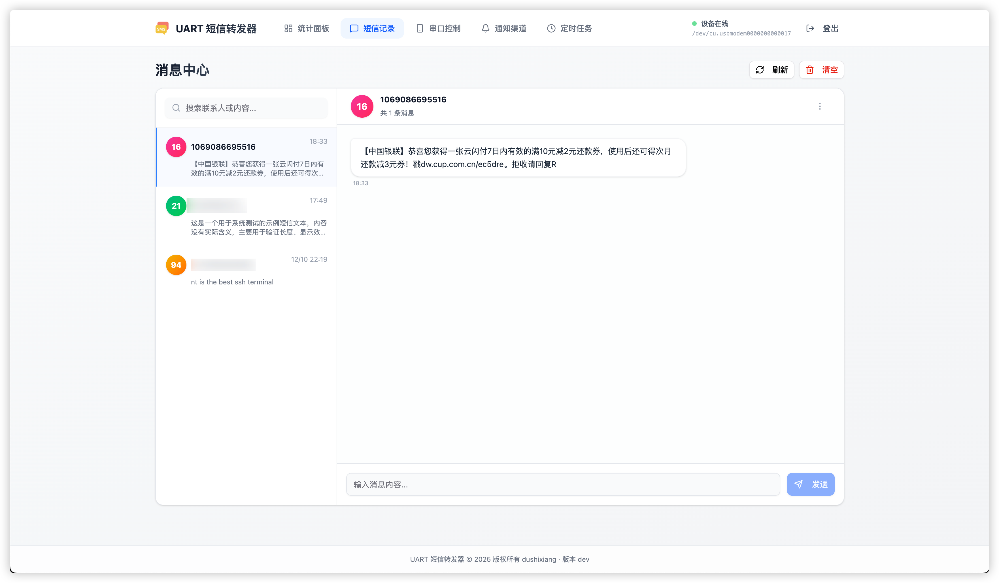

# Air780E 短信UART转发器

基于 Air780E 设备的短信转发系统，支持接收短信并通过串口转发到上位机。

**已测试设备**

- Air780E
- Air780EHV


## 🌟 功能特性

- 📱 自动接收短信并转发到串口
- 🔄 支持双向通信（可通过串口发送短信）
- 📊 JSON格式数据传输
- 💾 消息缓存机制
- 🐕 看门狗保护
- 💓 心跳状态上报
- 🛡️ 错误处理和内存管理

## 截图




## 🚀 快速开始

### 1. 硬件准备

**Air780E 设备准备**：
- 插入有效的SIM卡
- 通过USB连接电脑

### 2. 烧录 Lua 脚本

使用 **LuaTools** 烧录 `main.lua` 脚本，第一次烧录需要点击 「下载底层和脚本」


### 3. 测试


### 4. 把设备插入到你的小主机等 Linux USB上


### 5. 运行上位机程序

下载 release 中的压缩包，解压之后进入目录，执行

```bash
./uart_sms_forwarder
```

等待程序启动，默认会自动识别串口，确定串口之后，建议更改 config.yaml 中的串口配置。
